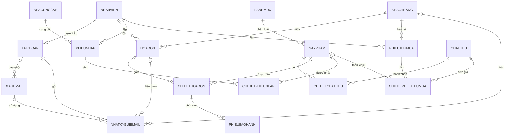

# HỆ THỐNG QUẢN LÝ CỬA HÀNG ĐÁ QUÝ PNJ

**Tên cơ sở dữ liệu:** `QL_CuaHangDaQuy_PNJ`  
**Nền tảng:** SQL Server, Windows Forms .NET Framework 4.7.2  
**ORM:** Entity Framework 6 Database First / EDMX  
**Ngôn ngữ:** C#  
**Phiên bản tài liệu:** 2.0 — Thiết kế thống nhất 17 bảng nghiệp vụ

---

## Mục lục

1. Mục tiêu và phạm vi
2. Nền tảng triển khai
3. Các quyết định thiết kế
4. Danh sách 17 bảng nghiệp vụ
5. Sơ đồ quan hệ dữ liệu
6. Từ điển dữ liệu
7. Quan hệ, khóa và quy tắc xóa
8. Mã hiển thị tự động
9. Quy tắc nghiệp vụ
10. Kiểm tra dữ liệu và xử lý lỗi
11. Giao diện và chức năng
12. Tìm kiếm, thống kê, Excel và Report
13. Entity Framework và LINQ
14. Bảo mật
15. Dữ liệu mẫu
16. Đối chiếu rubric
17. Kịch bản demo
18. Sản phẩm cần nộp
19. DDL SQL Server tham khảo
20. Checklist hoàn thành
21. Kết luận

---

# 1. Mục tiêu và phạm vi

Hệ thống được xây dựng cho cửa hàng trang sức và đá quý, hỗ trợ:

- Đăng nhập, đổi/reset mật khẩu và phân quyền.
- Quản lý riêng hồ sơ nhân viên và tài khoản đăng nhập.
- Quản lý khách hàng, danh mục, nhà cung cấp và chất liệu.
- Quản lý sản phẩm, thành phần chất liệu, giá và tồn kho.
- Bán hàng, nhập hàng từ nhà cung cấp và thu mua từ khách hàng.
- Theo dõi hạn bảo hành và từng lần tiếp nhận bảo hành.
- Quản lý mẫu email, gửi email và lưu nhật ký gửi.
- Tìm kiếm đa tiêu chí, thống kê, Excel, Report và Backup/Restore.

Thiết kế 17 bảng được lựa chọn vì mỗi bảng có một trách nhiệm nghiệp vụ rõ ràng. Số bảng nhiều hơn mô hình tối giản nhưng tránh gộp sai nhân viên–tài khoản, chất liệu–sản phẩm hoặc hạn bảo hành–lịch sử bảo hành.

---

# 2. Nền tảng triển khai

- Windows Forms, C#, .NET Framework 4.7.2.
- SQL Server.
- Entity Framework 6 Database First / EDMX.
- LINQ to Entities.
- Guna UI2 cho giao diện.
- BCrypt để băm mật khẩu.
- RDLC + ReportViewer cho Report.
- Thư viện xuất `.xlsx` tương thích .NET Framework 4.7.2.

Không sử dụng Entity Framework Core, .NET Core hoặc .NET 5+. Mọi package phải hỗ trợ net472, được cố định phiên bản và thử restore/build trên môi trường sạch.

---

# 3. Các quyết định thiết kế

## 3.1. Nhân viên và tài khoản

`NhanVien` và `TaiKhoan` được tách riêng:

- `NhanVien` lưu hồ sơ nhân sự và được chứng từ nghiệp vụ tham chiếu.
- `TaiKhoan` chỉ lưu thông tin xác thực, vai trò và trạng thái đăng nhập.
- Một nhân viên có tối đa một tài khoản; nhân viên có thể chưa được cấp tài khoản.
- Khóa tài khoản không làm mất lịch sử giao dịch của nhân viên.

```text
NhanVien 1 ─── 0..1 TaiKhoan
```

## 3.2. Danh mục, chất liệu và sản phẩm

- Sử dụng tên bảng `DanhMuc` để thống nhất với source.
- Một sản phẩm thuộc một danh mục.
- `ChatLieu` lưu danh mục chất liệu và giá tham khảo.
- `ChiTietChatLieu` biểu diễn quan hệ nhiều–nhiều; một sản phẩm có thể gồm nhiều chất liệu với trọng lượng riêng.

## 3.3. Nhà cung cấp

Nhà cung cấp thực tế được xác định qua `PhieuNhap`. Không bắt buộc gắn một nhà cung cấp cố định vào sản phẩm vì cùng sản phẩm có thể được nhập từ nhiều nguồn.

## 3.4. Thu mua từ khách hàng

- `PhieuNhap` ghi nhận hàng nhập từ nhà cung cấp.
- `PhieuThuMua` ghi nhận vàng, đá quý hoặc trang sức cửa hàng mua lại từ khách hàng.
- Hai nghiệp vụ được tách để thống kê và kiểm soát chính xác.

## 3.5. Bảo hành

- `ChiTietHoaDon.HanBaoHanh` cho biết thời hạn được bảo hành.
- `PhieuBaoHanh` lưu từng lần khách mang sản phẩm đến bảo hành.
- Một dòng hóa đơn có thể phát sinh nhiều phiếu bảo hành.

## 3.6. Email

Giữ đầy đủ hai bảng:

- `MauEmail` quản lý các mẫu nội dung dùng lại.
- `NhatKyGuiEmail` lưu từng lần gửi thành công hoặc thất bại.
- Nhật ký lưu snapshot email nhận và tiêu đề để lịch sử không đổi khi dữ liệu gốc được sửa.

## 3.7. Khóa chính và xóa dữ liệu

- Bảng đầu mục dùng `INT IDENTITY`; `NhatKyGuiEmail` dùng `BIGINT IDENTITY`.
- `ChiTietChatLieu` dùng khóa kép `(SanPhamId, ChatLieuId)`.
- Bảng chi tiết giao dịch dùng khóa `INT IDENTITY` và `UNIQUE` phù hợp.
- Người dùng không nhập khóa chính.
- Dữ liệu chưa được tham chiếu có thể xóa vật lý; dữ liệu đã có lịch sử được xóa mềm/khóa.
- Chứng từ hoàn thành được hủy bằng trạng thái, không xóa vật lý.
- Không dùng `ON DELETE CASCADE` cho dữ liệu nghiệp vụ.

---

# 4. Danh sách 17 bảng nghiệp vụ

| STT | Bảng | Chức năng |
|---:|---|---|
| 1 | `NhanVien` | Hồ sơ nhân viên |
| 2 | `TaiKhoan` | Đăng nhập, phân quyền, reset mật khẩu |
| 3 | `KhachHang` | Thông tin khách hàng và tích điểm |
| 4 | `DanhMuc` | Phân loại sản phẩm |
| 5 | `NhaCungCap` | Thông tin nhà cung cấp |
| 6 | `ChatLieu` | Chất liệu và giá mua/bán tham khảo |
| 7 | `SanPham` | Sản phẩm, giá và tồn kho |
| 8 | `ChiTietChatLieu` | Thành phần chất liệu của sản phẩm |
| 9 | `HoaDon` | Đầu phiếu bán hàng |
| 10 | `ChiTietHoaDon` | Sản phẩm trong hóa đơn |
| 11 | `PhieuNhap` | Đầu phiếu nhập từ nhà cung cấp |
| 12 | `ChiTietPhieuNhap` | Sản phẩm trong phiếu nhập |
| 13 | `PhieuThuMua` | Đầu phiếu thu mua từ khách hàng |
| 14 | `ChiTietPhieuThuMua` | Món/chất liệu được thu mua |
| 15 | `PhieuBaoHanh` | Các lần tiếp nhận bảo hành |
| 16 | `MauEmail` | Mẫu tiêu đề và nội dung email |
| 17 | `NhatKyGuiEmail` | Lịch sử gửi email |

`sysdiagrams` là bảng hệ thống của SQL Server, không tính là bảng nghiệp vụ và không áp dụng yêu cầu dữ liệu mẫu.

---

# 5. Sơ đồ quan hệ dữ liệu



---

# 6. Từ điển dữ liệu

## 6.1. `NhanVien`

| Cột | Kiểu | NULL | Ý nghĩa |
|---|---|:---:|---|
| `NhanVienId` | `INT IDENTITY` | Không | PK |
| `HoTen` | `NVARCHAR(150)` | Không | Họ tên nhân viên |
| `GioiTinh` | `NVARCHAR(10)` | Có | Giới tính |
| `NgaySinh` | `DATE` | Có | Ngày sinh |
| `SoDienThoai` | `VARCHAR(15)` | Có | Số điện thoại |
| `Email` | `VARCHAR(254)` | Có | Email |
| `DiaChi` | `NVARCHAR(255)` | Có | Địa chỉ |
| `ChucVu` | `NVARCHAR(50)` | Không | Chức vụ nghiệp vụ |
| `DangLamViec` | `BIT` | Không | Trạng thái nhân sự |

## 6.2. `TaiKhoan`

| Cột | Kiểu | NULL | Ý nghĩa |
|---|---|:---:|---|
| `TaiKhoanId` | `INT IDENTITY` | Không | PK |
| `NhanVienId` | `INT` | Không | FK và UNIQUE; mỗi nhân viên tối đa một tài khoản |
| `TenDangNhap` | `VARCHAR(50)` | Không | UNIQUE |
| `MatKhauHash` | `VARCHAR(255)` | Không | Hash BCrypt |
| `VaiTro` | `VARCHAR(20)` | Không | `ADMIN` hoặc `NHANVIEN` |
| `PhaiDoiMatKhau` | `BIT` | Không | Bắt buộc đổi mật khẩu sau reset |
| `DangHoatDong` | `BIT` | Không | Khóa/mở tài khoản |

## 6.3. `KhachHang`

| Cột | Kiểu | NULL | Ý nghĩa |
|---|---|:---:|---|
| `KhachHangId` | `INT IDENTITY` | Không | PK |
| `HoTen` | `NVARCHAR(150)` | Không | Tên khách hàng |
| `SoDienThoai` | `VARCHAR(15)` | Không | UNIQUE |
| `Email` | `VARCHAR(254)` | Có | Email nhận thông báo |
| `DiaChi` | `NVARCHAR(255)` | Có | Địa chỉ |
| `NgaySinh` | `DATE` | Có | Chăm sóc khách hàng |
| `ChoPhepNhanEmail` | `BIT` | Không | Đồng ý nhận email |
| `DiemTichLuy` | `INT` | Không | Không âm |
| `DangHoatDong` | `BIT` | Không | Xóa mềm |

Hệ thống có bản ghi đặc biệt:

```text
HoTen = Khách lẻ
SoDienThoai = 0000000000
ChoPhepNhanEmail = 0
```

Bản ghi này không được xóa, khóa hoặc dùng để gửi email marketing.

## 6.4. `DanhMuc`

| Cột | Kiểu | NULL | Ý nghĩa |
|---|---|:---:|---|
| `DanhMucId` | `INT IDENTITY` | Không | PK |
| `TenDanhMuc` | `NVARCHAR(100)` | Không | UNIQUE |
| `MoTa` | `NVARCHAR(255)` | Có | Mô tả |
| `DangHoatDong` | `BIT` | Không | Xóa mềm |

## 6.5. `NhaCungCap`

| Cột | Kiểu | NULL | Ý nghĩa |
|---|---|:---:|---|
| `NhaCungCapId` | `INT IDENTITY` | Không | PK |
| `TenNhaCungCap` | `NVARCHAR(150)` | Không | UNIQUE |
| `NguoiLienHe` | `NVARCHAR(100)` | Có | Người đại diện |
| `SoDienThoai` | `VARCHAR(15)` | Không | UNIQUE |
| `Email` | `VARCHAR(254)` | Có | Email liên hệ |
| `DiaChi` | `NVARCHAR(255)` | Có | Địa chỉ |
| `DangHoatDong` | `BIT` | Không | Xóa mềm |

## 6.6. `ChatLieu`

| Cột | Kiểu | NULL | Ý nghĩa |
|---|---|:---:|---|
| `ChatLieuId` | `INT IDENTITY` | Không | PK |
| `TenChatLieu` | `NVARCHAR(100)` | Không | UNIQUE |
| `GiaMuaVao` | `DECIMAL(18,2)` | Không | Giá tham khảo, không âm |
| `GiaBanRa` | `DECIMAL(18,2)` | Không | Giá tham khảo, không âm |
| `DangHoatDong` | `BIT` | Không | Xóa mềm |

## 6.7. `SanPham`

| Cột | Kiểu | NULL | Ý nghĩa |
|---|---|:---:|---|
| `SanPhamId` | `INT IDENTITY` | Không | PK |
| `DanhMucId` | `INT` | Không | FK → `DanhMuc` |
| `TenSanPham` | `NVARCHAR(150)` | Không | Tên sản phẩm |
| `GiaVon` | `DECIMAL(18,2)` | Không | Giá vốn hiện tại |
| `GiaBan` | `DECIMAL(18,2)` | Không | Giá bán hiện tại |
| `SoLuongTon` | `INT` | Không | Không âm |
| `DuongDanAnh` | `NVARCHAR(500)` | Có | Đường dẫn tương đối |
| `DangKinhDoanh` | `BIT` | Không | Xóa mềm |

Barcode/QR được sinh từ mã hiển thị của `SanPhamId`, không cần lưu ảnh barcode trong CSDL.

## 6.8. `ChiTietChatLieu`

| Cột | Kiểu | NULL | Ý nghĩa |
|---|---|:---:|---|
| `SanPhamId` | `INT` | Không | PK kép, FK |
| `ChatLieuId` | `INT` | Không | PK kép, FK |
| `TrongLuong` | `DECIMAL(10,3)` | Không | Lớn hơn 0 |
| `DonViTinh` | `NVARCHAR(20)` | Không | Gram, carat... |

## 6.9. `HoaDon`

| Cột | Kiểu | NULL | Ý nghĩa |
|---|---|:---:|---|
| `HoaDonId` | `INT IDENTITY` | Không | PK |
| `NhanVienId` | `INT` | Không | FK → nhân viên lập |
| `KhachHangId` | `INT` | Không | FK → khách mua |
| `NgayLap` | `DATETIME2` | Không | Ngày lập |
| `TongTien` | `DECIMAL(18,2)` | Không | Tổng trước giảm giá |
| `GiamGia` | `DECIMAL(18,2)` | Không | Số tiền giảm |
| `ThanhTien` | `DECIMAL(18,2)` | Không | Tổng thanh toán |
| `PhuongThucThanhToan` | `NVARCHAR(50)` | Không | Tiền mặt, chuyển khoản... |
| `TrangThai` | `VARCHAR(20)` | Không | `DA_THANH_TOAN` hoặc `DA_HUY` |

## 6.10. `ChiTietHoaDon`

| Cột | Kiểu | NULL | Ý nghĩa |
|---|---|:---:|---|
| `ChiTietHoaDonId` | `INT IDENTITY` | Không | PK |
| `HoaDonId` | `INT` | Không | FK |
| `SanPhamId` | `INT` | Không | FK |
| `SoLuong` | `INT` | Không | Lớn hơn 0 |
| `DonGiaBan` | `DECIMAL(18,2)` | Không | Snapshot giá bán |
| `ThanhTien` | Computed | Không | `SoLuong × DonGiaBan` |
| `HanBaoHanh` | `DATE` | Có | Hạn bảo hành của dòng sản phẩm |

`UNIQUE(HoaDonId, SanPhamId)` tránh trùng cùng sản phẩm trong một hóa đơn.

## 6.11. `PhieuNhap`

| Cột | Kiểu | NULL | Ý nghĩa |
|---|---|:---:|---|
| `PhieuNhapId` | `INT IDENTITY` | Không | PK |
| `NhanVienId` | `INT` | Không | FK → nhân viên lập |
| `NhaCungCapId` | `INT` | Không | FK → nhà cung cấp |
| `NgayNhap` | `DATETIME2` | Không | Ngày nhập |
| `TongTienNhap` | `DECIMAL(18,2)` | Không | Tổng giá trị phiếu |
| `TrangThai` | `VARCHAR(20)` | Không | `HOAN_THANH` hoặc `DA_HUY` |
| `GhiChu` | `NVARCHAR(500)` | Có | Ghi chú |

## 6.12. `ChiTietPhieuNhap`

| Cột | Kiểu | NULL | Ý nghĩa |
|---|---|:---:|---|
| `ChiTietPhieuNhapId` | `INT IDENTITY` | Không | PK |
| `PhieuNhapId` | `INT` | Không | FK |
| `SanPhamId` | `INT` | Không | FK |
| `SoLuong` | `INT` | Không | Lớn hơn 0 |
| `DonGiaNhap` | `DECIMAL(18,2)` | Không | Snapshot giá nhập |
| `ThanhTien` | Computed | Không | `SoLuong × DonGiaNhap` |

`UNIQUE(PhieuNhapId, SanPhamId)` tránh trùng sản phẩm trong một phiếu nhập.

## 6.13. `PhieuThuMua`

| Cột | Kiểu | NULL | Ý nghĩa |
|---|---|:---:|---|
| `PhieuThuMuaId` | `INT IDENTITY` | Không | PK |
| `NhanVienId` | `INT` | Không | FK → nhân viên lập |
| `KhachHangId` | `INT` | Không | FK → khách bán lại |
| `NgayThuMua` | `DATETIME2` | Không | Ngày thu mua |
| `TongTienThuMua` | `DECIMAL(18,2)` | Không | Tổng tiền trả khách |
| `TrangThai` | `VARCHAR(20)` | Không | `HOAN_THANH` hoặc `DA_HUY` |
| `GhiChu` | `NVARCHAR(500)` | Có | Ghi chú |

## 6.14. `ChiTietPhieuThuMua`

| Cột | Kiểu | NULL | Ý nghĩa |
|---|---|:---:|---|
| `ChiTietPhieuThuMuaId` | `INT IDENTITY` | Không | PK |
| `PhieuThuMuaId` | `INT` | Không | FK |
| `ChatLieuId` | `INT` | Không | FK → chất liệu định giá |
| `SanPhamId` | `INT` | Có | FK tùy chọn nếu nhận diện được sản phẩm cũ |
| `TenSanPhamThu` | `NVARCHAR(150)` | Không | Snapshot tên món thu mua |
| `TrongLuong` | `DECIMAL(10,3)` | Không | Lớn hơn 0 |
| `DonViTinh` | `NVARCHAR(20)` | Không | Gram, chỉ... |
| `DonGiaThuMua` | `DECIMAL(18,2)` | Không | Giá tại thời điểm thu mua |
| `ThanhTien` | Computed | Không | `TrongLuong × DonGiaThuMua` |

## 6.15. `PhieuBaoHanh`

| Cột | Kiểu | NULL | Ý nghĩa |
|---|---|:---:|---|
| `PhieuBaoHanhId` | `INT IDENTITY` | Không | PK |
| `ChiTietHoaDonId` | `INT` | Không | FK → sản phẩm đã bán |
| `NgayTiepNhan` | `DATETIME2` | Không | Ngày nhận bảo hành |
| `NoiDungBaoHanh` | `NVARCHAR(500)` | Không | Nội dung/yêu cầu |
| `TrangThai` | `VARCHAR(20)` | Không | Trạng thái xử lý |
| `NgayTraDuKien` | `DATE` | Có | Ngày dự kiến trả |
| `NgayTraThucTe` | `DATETIME2` | Có | Ngày đã trả khách |
| `GhiChu` | `NVARCHAR(500)` | Có | Ghi chú |

## 6.16. `MauEmail`

| Cột | Kiểu | NULL | Ý nghĩa |
|---|---|:---:|---|
| `MauEmailId` | `INT IDENTITY` | Không | PK |
| `TenMau` | `NVARCHAR(100)` | Không | UNIQUE |
| `TieuDeMau` | `NVARCHAR(255)` | Không | Tiêu đề mẫu |
| `NoiDungMau` | `NVARCHAR(MAX)` | Không | Nội dung mẫu |
| `DangHoatDong` | `BIT` | Không | Xóa mềm |
| `TaiKhoanCapNhatId` | `INT` | Có | FK → người cập nhật |
| `NgayCapNhat` | `DATETIME2` | Không | Thời gian cập nhật |

## 6.17. `NhatKyGuiEmail`

| Cột | Kiểu | NULL | Ý nghĩa |
|---|---|:---:|---|
| `NhatKyGuiEmailId` | `BIGINT IDENTITY` | Không | PK |
| `TaiKhoanId` | `INT` | Không | FK → người gửi |
| `KhachHangId` | `INT` | Có | FK tùy chọn |
| `HoaDonId` | `INT` | Có | FK tùy chọn |
| `MauEmailId` | `INT` | Có | FK tùy chọn |
| `ThoiGianGui` | `DATETIME2` | Không | Thời gian gửi |
| `EmailNhan` | `VARCHAR(254)` | Không | Snapshot địa chỉ nhận |
| `TieuDe` | `NVARCHAR(255)` | Không | Snapshot tiêu đề |
| `LoaiGui` | `VARCHAR(20)` | Không | `DON` hoặc `HANG_LOAT` |
| `TrangThai` | `VARCHAR(20)` | Không | `THANH_CONG` hoặc `THAT_BAI` |
| `GhiChu` | `NVARCHAR(1000)` | Có | Lỗi hoặc ghi chú |

---

# 7. Quan hệ, khóa và quy tắc xóa

| Bảng cha | Bảng con | Quan hệ | Xử lý xóa |
|---|---|---|---|
| `NhanVien` | `TaiKhoan` | 1–0..1 | Khóa tài khoản; không xóa nhân viên đã có giao dịch |
| `NhanVien` | Các chứng từ | 1–n | Không xóa khi đã phát sinh lịch sử |
| `DanhMuc` | `SanPham` | 1–n | Chưa tham chiếu: xóa; đã dùng: xóa mềm |
| `SanPham`/`ChatLieu` | `ChiTietChatLieu` | 1–n | Chỉ xóa chi tiết khi chưa ảnh hưởng lịch sử |
| `KhachHang` | Hóa đơn/thu mua | 1–n | Đã có lịch sử: xóa mềm |
| `HoaDon` | `ChiTietHoaDon` | 1–n | Hủy hóa đơn, không xóa lịch sử |
| `ChiTietHoaDon` | `PhieuBaoHanh` | 1–n | Không xóa lịch sử bảo hành |
| `NhaCungCap` | `PhieuNhap` | 1–n | Đã có phiếu: xóa mềm |
| `PhieuNhap` | `ChiTietPhieuNhap` | 1–n | Hủy phiếu, không xóa lịch sử |
| `PhieuThuMua` | `ChiTietPhieuThuMua` | 1–n | Không xóa chứng từ hoàn thành |
| `TaiKhoan` | `MauEmail`/`NhatKyGuiEmail` | 1–n | Khóa tài khoản nhưng giữ lịch sử |
| `KhachHang`/`HoaDon`/`MauEmail` | `NhatKyGuiEmail` | 0..1–n | FK nullable, không xóa nhật ký |

Tất cả foreign key nghiệp vụ dùng `NO ACTION`. Ứng dụng kiểm tra tham chiếu trước khi xóa và hiển thị thông báo rõ ràng.

---

# 8. Mã hiển thị tự động

Khóa `IDENTITY` dùng nội bộ. Mã thân thiện được tạo trong partial class hoặc ViewModel:

| Đối tượng | Định dạng |
|---|---|
| Nhân viên | `NV000001` |
| Tài khoản | `TK000001` |
| Khách hàng | `KH000001` |
| Danh mục | `DM000001` |
| Nhà cung cấp | `NCC000001` |
| Chất liệu | `CL000001` |
| Sản phẩm | `SP000001` |
| Hóa đơn | `HD000001` |
| Phiếu nhập | `PN000001` |
| Phiếu thu mua | `PTM000001` |
| Phiếu bảo hành | `PBH000001` |
| Mẫu email | `ME000001` |

```csharp
public partial class SanPham
{
    public string MaHienThi
    {
        get
        {
            return SanPhamId > 0
                ? string.Format("SP{0:D6}", SanPhamId)
                : "(Tự động)";
        }
    }
}
```

Không sửa trực tiếp entity do EDMX sinh tự động.

---

# 9. Quy tắc nghiệp vụ

## 9.1. Đăng nhập và phân quyền

- Chỉ tài khoản `DangHoatDong = 1` và nhân viên `DangLamViec = 1` được đăng nhập.
- Mật khẩu được hash/xác thực bằng BCrypt.
- `ADMIN` quản lý tài khoản, reset mật khẩu, backup/restore và toàn bộ danh mục.
- `NHANVIEN` thực hiện các nghiệp vụ được cấp quyền.
- Phân quyền phải được kiểm tra cả trên giao diện và trong hàm xử lý.
- Reset mật khẩu phải lưu hash mật khẩu tạm và đặt `PhaiDoiMatKhau = 1`.
- Không cung cấp tự đăng ký tài khoản công khai; tài khoản do Admin cấp cho nhân viên.

## 9.2. Bán hàng

Lập hóa đơn trong một transaction:

1. Chọn khách hàng và xác định nhân viên đang đăng nhập.
2. Hóa đơn có ít nhất một sản phẩm.
3. Kiểm tra số lượng lớn hơn 0 và tồn kho đủ.
4. Lưu `HoaDon` và `ChiTietHoaDon`.
5. Lưu snapshot giá bán và hạn bảo hành.
6. Trừ tồn kho; tính tổng tiền, giảm giá và thành tiền.
7. Commit; nếu lỗi thì rollback toàn bộ.

```text
TongTien  = SUM(SoLuong × DonGiaBan)
ThanhTien = TongTien - GiamGia
```

Hủy hóa đơn:

- Chỉ hủy hóa đơn `DA_THANH_TOAN`.
- Cộng lại tồn kho, đặt `TrangThai = 'DA_HUY'` trong transaction.
- Không cho hủy lần hai.
- Không tính hóa đơn hủy vào doanh thu hoặc bảo hành còn hiệu lực.

## 9.3. Nhập hàng

1. Chọn nhà cung cấp; nhân viên lấy từ phiên đăng nhập.
2. Phiếu có ít nhất một sản phẩm.
3. Kiểm tra số lượng và đơn giá nhập lớn hơn 0.
4. Lưu đầu phiếu/chi tiết, cộng tồn kho và cập nhật `SanPham.GiaVon`.
5. Tính `TongTienNhap` và commit trong một transaction.

Khi hủy phiếu nhập:

- Chỉ hủy phiếu `HOAN_THANH`.
- Kiểm tra tồn hiện tại đủ để hoàn tác.
- Trừ số lượng đã nhập.
- Tìm lần nhập hợp lệ gần nhất để khôi phục `GiaVon`.
- Đặt `TrangThai = 'DA_HUY'` trong cùng transaction.

## 9.4. Thu mua từ khách hàng

1. Chọn khách hàng; nhân viên lấy từ phiên đăng nhập.
2. Phiếu có ít nhất một dòng chi tiết.
3. Chọn chất liệu, nhập tên món, trọng lượng và đơn vị.
4. Đơn giá mặc định từ `ChatLieu.GiaMuaVao`, người có quyền có thể điều chỉnh.
5. Lưu snapshot dữ liệu và tính tổng tiền trong transaction.

```text
ThanhTienDong  = TrongLuong × DonGiaThuMua
TongTienThuMua = SUM(ThanhTienDong)
```

Phiếu hoàn thành không xóa vật lý. Phiếu `DA_HUY` không được tính vào thống kê thu mua thực tế.

## 9.5. Bảo hành

- Chỉ lập phiếu cho sản phẩm thuộc hóa đơn `DA_THANH_TOAN`.
- Ứng dụng thông báo rõ sản phẩm còn hạn hay hết hạn.
- Một dòng hóa đơn có thể có nhiều phiếu bảo hành.
- Luồng trạng thái: `TIEP_NHAN` → `DANG_XU_LY` → `HOAN_THANH` → `DA_TRA`.
- Không xóa phiếu đã tiếp nhận; chỉ cập nhật trạng thái và ghi chú.
- `NgayTraThucTe` chỉ nhập khi hoàn thành hoặc đã trả.

## 9.6. Email

- Chỉ gửi hàng loạt cho khách đang hoạt động, cho phép nhận email và có email hợp lệ.
- Không gửi marketing cho `Khách lẻ`.
- Email đơn lẻ có thể gắn với khách hàng hoặc hóa đơn.
- Mẫu email là tùy chọn; người dùng có thể tự soạn nội dung.
- Mỗi lần gửi đều tạo `NhatKyGuiEmail` dù thành công hay thất bại.
- Không lưu mật khẩu SMTP trong CSDL hoặc nhật ký.

---

# 10. Kiểm tra dữ liệu và xử lý lỗi

## 10.1. Kiểm tra chung

- Không để trống trường bắt buộc; cắt khoảng trắng phù hợp.
- Kiểm tra độ dài theo schema.
- Giá, số lượng, trọng lượng, điểm và tồn kho không âm.
- Số lượng giao dịch và trọng lượng thu mua phải lớn hơn 0.
- Ngày sinh không lớn hơn hiện tại.
- Hạn bảo hành không nhỏ hơn ngày bán.
- Ngày trả bảo hành không nhỏ hơn ngày tiếp nhận.

## 10.2. Kiểm tra trùng

- Tên đăng nhập; một nhân viên không có hai tài khoản.
- Số điện thoại khách hàng.
- Tên danh mục, nhà cung cấp, chất liệu và mẫu email.
- Số điện thoại nhà cung cấp.
- Sản phẩm trong cùng hóa đơn/phiếu nhập.
- Chất liệu trong cùng sản phẩm.

Khóa `IDENTITY` do SQL Server sinh. Ứng dụng kiểm tra khóa nghiệp vụ `UNIQUE` và vẫn bắt `DbUpdateException` để xử lý ghi đồng thời.

## 10.3. Khóa ngoại và lỗi

- ComboBox dùng tên làm `DisplayMember`, ID làm `ValueMember`.
- Không hiển thị bản ghi bị khóa khi tạo giao dịch mới; lịch sử cũ vẫn hiển thị tên.
- Không hiển thị stack trace, connection string hoặc nguyên exception nhạy cảm.
- Phân biệt lỗi validation, kết nối, UNIQUE/FK và lỗi nghiệp vụ.
- Transaction rollback khi bất kỳ bước nào thất bại.

---

# 11. Giao diện và chức năng

| Form | Chức năng |
|---|---|
| `FrmDangNhap` | Đăng nhập, hiện/ẩn mật khẩu |
| `FrmDoiMatKhau` | Đổi mật khẩu bắt buộc/chủ động |
| `FrmMain` | Menu chính và mở form con |
| `FrmTaiKhoan` | CRUD tài khoản, phân quyền, reset mật khẩu |
| `FrmNhanVien` | CRUD, tìm kiếm nhân viên |
| `FrmKhachHang` | CRUD, tìm kiếm khách hàng |
| `FrmDanhMuc` | CRUD danh mục |
| `FrmNhaCungCap` | CRUD nhà cung cấp |
| `FrmChatLieu` | CRUD chất liệu và giá tham khảo |
| `FrmSanPham` | CRUD sản phẩm, thành phần chất liệu, ảnh, barcode |
| `FrmBanHang` | Lập hóa đơn và chi tiết |
| `FrmHoaDon` | Lịch sử, tìm kiếm, hủy và in hóa đơn |
| `FrmNhapHang` | Lập phiếu nhập và lịch sử nhập |
| `FrmThuMua` | Lập phiếu thu mua và lịch sử thu mua |
| `FrmBaoHanh` | Tiếp nhận, xử lý và trả bảo hành |
| `FrmQuanLyEmail` | Mẫu email, gửi email và nhật ký |
| `FrmThongKe` | Thống kê, biểu đồ và xuất dữ liệu |
| `FrmSaoLuuPhucHoi` | Backup và Restore |

Main Form phải mở được các form con. Form quản lý có DataGridView, ComboBox khóa ngoại, Thêm/Sửa/Xóa/Làm mới và validation rõ ràng. Nút/chức năng được ẩn hoặc khóa theo vai trò.

---

# 12. Tìm kiếm, thống kê, Excel và Report

## 12.1. Tìm kiếm đa tiêu chí

- **Sản phẩm:** mã/tên, danh mục, chất liệu, khoảng giá, tồn kho, trạng thái kinh doanh.
- **Hóa đơn:** khoảng ngày, khách hàng, nhân viên, sản phẩm, trạng thái, khoảng tiền.
- **Phiếu nhập:** khoảng ngày, nhà cung cấp, nhân viên, sản phẩm, trạng thái.
- **Phiếu thu mua:** khoảng ngày, khách hàng, nhân viên, chất liệu, trạng thái.
- **Bảo hành:** mã phiếu, khách hàng, hóa đơn/sản phẩm, ngày tiếp nhận, hạn và trạng thái.
- **Nhật ký email:** thời gian, email nhận, khách hàng, mẫu, loại gửi và trạng thái.

## 12.2. Thống kê

- Doanh thu theo ngày/tháng/khoảng ngày; số và giá trị trung bình hóa đơn.
- Top sản phẩm bán chạy; doanh thu theo danh mục, chất liệu và nhân viên.
- Sản phẩm tồn thấp.
- Tổng tiền nhập theo tháng/nhà cung cấp; số lượng nhập theo sản phẩm.
- Tổng tiền thu mua theo tháng, khách hàng và chất liệu.
- Số phiếu bảo hành theo trạng thái; sản phẩm sắp hết hạn bảo hành.
- Số email thành công/thất bại, tỷ lệ thành công và số email theo mẫu.

Chỉ tính giao dịch hợp lệ:

```text
HoaDon.TrangThai = DA_THANH_TOAN
PhieuNhap.TrangThai = HOAN_THANH
PhieuThuMua.TrangThai = HOAN_THANH
```

## 12.3. Report và Excel

Report tối thiểu: hóa đơn, phiếu nhập, phiếu thu mua và phiếu tiếp nhận bảo hành. Dùng RDLC + ReportViewer và dữ liệu chuẩn bị qua EF/LINQ hoặc DTO.

Excel tối thiểu xuất: sản phẩm, hóa đơn, nhập hàng, thu mua, bảo hành và nhật ký email. File `.xlsx` phải có tiêu đề cột, định dạng ngày/số tiền và tên file rõ ràng.

---

# 13. Entity Framework và LINQ

- CRUD chính dùng `DbContext` của EF6 Database First.
- Không sửa entity do EDMX sinh; schema đổi thì `Update Model from Database`.
- Thuộc tính bổ sung đặt trong partial class/ViewModel.
- LINQ dùng cho tìm kiếm, thống kê và truy vấn nhiều bảng.
- Bán, nhập, thu mua và hủy giao dịch dùng transaction.
- Typed DataSet/TableAdapter không thay thế EF cho CRUD chính; nếu không dùng thì loại khỏi project.

```csharp
var query = context.SanPhams
    .Include("DanhMuc")
    .Include("ChiTietChatLieux.ChatLieu")
    .AsQueryable();

if (!string.IsNullOrWhiteSpace(tuKhoa))
    query = query.Where(x => x.TenSanPham.Contains(tuKhoa));

if (danhMucId.HasValue)
    query = query.Where(x => x.DanhMucId == danhMucId.Value);

if (chatLieuId.HasValue)
    query = query.Where(x =>
        x.ChiTietChatLieux.Any(ct => ct.ChatLieuId == chatLieuId.Value));
```

---

# 14. Bảo mật

- Dùng BCrypt; không lưu/log mật khẩu rõ và không tự đăng ký tài khoản công khai.
- Reset bằng mật khẩu tạm và bắt buộc đổi ở lần đăng nhập sau.
- Kiểm tra quyền trong cả giao diện lẫn nghiệp vụ.
- Không hard-code hoặc lưu plaintext mật khẩu SMTP.
- Có thể bảo vệ thông tin SMTP bằng DPAPI/Windows Credential Manager.
- Mã gửi email đặt trong service riêng, không đặt toàn bộ trong Form.
- Không nối chuỗi dữ liệu người dùng vào SQL và không hiển thị lỗi nhạy cảm.

---

# 15. Dữ liệu mẫu

Mỗi bảng nghiệp vụ phải có ít nhất 6 dòng trước khi tạo `.bak`.

| Bảng | Số dòng khuyến nghị |
|---|---:|
| `NhanVien`, `TaiKhoan`, `DanhMuc`, `ChatLieu`, `MauEmail` | 6–10 mỗi bảng |
| `KhachHang`, `NhaCungCap` | 8–10 mỗi bảng |
| `SanPham` | 15–20 |
| `ChiTietChatLieu` | 20–30 |
| `HoaDon`, `PhieuNhap`, `PhieuThuMua` | 8–10 mỗi bảng |
| `ChiTietHoaDon`, `ChiTietPhieuNhap` | 20–30 mỗi bảng |
| `ChiTietPhieuThuMua` | 12–20 |
| `PhieuBaoHanh` | 6–10 |
| `NhatKyGuiEmail` | 12–20 |

Thứ tự seed: `NhanVien` → `TaiKhoan` → `KhachHang` → `DanhMuc` → `NhaCungCap` → `ChatLieu` → `SanPham` → `ChiTietChatLieu` → `HoaDon` → `ChiTietHoaDon` → `PhieuNhap` → `ChiTietPhieuNhap` → `PhieuThuMua` → `ChiTietPhieuThuMua` → `PhieuBaoHanh` → `MauEmail` → `NhatKyGuiEmail`.

Dữ liệu phải có đủ trạng thái để demo: tài khoản bị khóa, sản phẩm nhiều chất liệu/tồn thấp, chứng từ hoàn thành/đã hủy, bảo hành nhiều trạng thái và email đơn/hàng loạt thành công/thất bại.

Trước khi tạo `.bak`, chạy truy vấn kiểm tra và xác nhận mọi kết quả đều từ 6 trở lên:

```sql
SELECT 'NhanVien' TenBang, COUNT(*) SoDong FROM dbo.NhanVien
UNION ALL SELECT 'TaiKhoan', COUNT(*) FROM dbo.TaiKhoan
UNION ALL SELECT 'KhachHang', COUNT(*) FROM dbo.KhachHang
UNION ALL SELECT 'DanhMuc', COUNT(*) FROM dbo.DanhMuc
UNION ALL SELECT 'NhaCungCap', COUNT(*) FROM dbo.NhaCungCap
UNION ALL SELECT 'ChatLieu', COUNT(*) FROM dbo.ChatLieu
UNION ALL SELECT 'SanPham', COUNT(*) FROM dbo.SanPham
UNION ALL SELECT 'ChiTietChatLieu', COUNT(*) FROM dbo.ChiTietChatLieu
UNION ALL SELECT 'HoaDon', COUNT(*) FROM dbo.HoaDon
UNION ALL SELECT 'ChiTietHoaDon', COUNT(*) FROM dbo.ChiTietHoaDon
UNION ALL SELECT 'PhieuNhap', COUNT(*) FROM dbo.PhieuNhap
UNION ALL SELECT 'ChiTietPhieuNhap', COUNT(*) FROM dbo.ChiTietPhieuNhap
UNION ALL SELECT 'PhieuThuMua', COUNT(*) FROM dbo.PhieuThuMua
UNION ALL SELECT 'ChiTietPhieuThuMua', COUNT(*) FROM dbo.ChiTietPhieuThuMua
UNION ALL SELECT 'PhieuBaoHanh', COUNT(*) FROM dbo.PhieuBaoHanh
UNION ALL SELECT 'MauEmail', COUNT(*) FROM dbo.MauEmail
UNION ALL SELECT 'NhatKyGuiEmail', COUNT(*) FROM dbo.NhatKyGuiEmail;
```

---

# 16. Đối chiếu rubric

| Tiêu chí | Điểm | Minh chứng cần có |
|---|---:|---|
| Thiết kế CSDL | 10 | 17 bảng, PK/FK/UNIQUE/CHECK, mỗi bảng ≥6 dòng, script và `.bak` |
| Entity Framework | 10 | EF6 Database First/EDMX, DbContext, CRUD, LINQ, transaction |
| Thiết kế giao diện | 10 | Đăng nhập, Main Form, form con, bố cục rõ |
| CRUD | 20 | CRUD các bảng quản lý và xử lý chứng từ |
| Hiển thị dữ liệu | 5 | DataGridView, ComboBox FK, Binding |
| Tìm kiếm | 10 | Một hoặc nhiều tiêu chí |
| Thống kê | 10 | Bán, nhập, thu mua, tồn, bảo hành, email |
| Excel/Report | 10 | RDLC/ReportViewer và `.xlsx` |
| Báo cáo Word | 10 | Đặc tả, CSDL, kết quả, hướng dẫn, ảnh, phụ lục code |
| Demo và nộp | 5 | Chạy ổn định, source, `.bak`, Word, hướng dẫn |

Điểm thưởng được chứng minh bằng phân quyền, BCrypt, reset password, Backup/Restore, Guna UI2, LINQ/truy vấn nhiều bảng, Barcode/QR, mã tự tăng và installer.

---

# 17. Kịch bản demo

1. Đăng nhập Admin và nhân viên để chứng minh BCrypt/phân quyền.
2. Thêm nhân viên, cấp tài khoản, reset và bắt buộc đổi mật khẩu.
3. CRUD danh mục, nhà cung cấp và chất liệu.
4. Thêm sản phẩm có nhiều chất liệu; hiển thị mã tự tăng và Barcode/QR.
5. Lập/hủy phiếu nhập và kiểm tra tồn kho, giá vốn.
6. Lập/hủy hóa đơn và kiểm tra tồn kho, doanh thu.
7. Lập phiếu thu mua, tính tiền theo chất liệu/trọng lượng.
8. Tiếp nhận bảo hành và cập nhật trạng thái.
9. CRUD mẫu email; gửi email đơn/hàng loạt và mở nhật ký.
10. Tìm kiếm, thống kê, Excel, Report và Backup.

---

# 18. Sản phẩm cần nộp

- Source code và solution.
- `QL_CuaHangDaQuy_PNJ.bak`.
- `01_CreateDatabase.sql`, `02_SeedData.sql`.
- Báo cáo Word theo mẫu, có hướng dẫn sử dụng, ảnh và phụ lục code.
- Hướng dẫn cài đặt; tài khoản/mật khẩu demo; phiên bản phần mềm.
- Cấu hình NuGet, file Excel/Report mẫu và installer nếu có.

```text
Tên CSDL: QL_CuaHangDaQuy_PNJ
Loại ứng dụng: Windows Forms
Target Framework: .NET Framework 4.7.2
ORM: Entity Framework 6 Database First / EDMX
Tài khoản Admin/Nhân viên demo: ...
Mật khẩu demo: ...
```

Không dùng mật khẩu thật trong sản phẩm nộp.

---

# 19. DDL SQL Server tham khảo

```sql
IF DB_ID(N'QL_CuaHangDaQuy_PNJ') IS NULL
    EXEC(N'CREATE DATABASE QL_CuaHangDaQuy_PNJ');
GO

USE QL_CuaHangDaQuy_PNJ;
GO

CREATE TABLE dbo.NhanVien
(
    NhanVienId      INT IDENTITY(1,1) PRIMARY KEY,
    HoTen           NVARCHAR(150) NOT NULL,
    GioiTinh        NVARCHAR(10) NULL,
    NgaySinh        DATE NULL,
    SoDienThoai     VARCHAR(15) NULL,
    Email            VARCHAR(254) NULL,
    DiaChi          NVARCHAR(255) NULL,
    ChucVu          NVARCHAR(50) NOT NULL,
    DangLamViec     BIT NOT NULL CONSTRAINT DF_NhanVien_DangLamViec DEFAULT 1
);
GO

CREATE UNIQUE INDEX UX_NhanVien_SoDienThoai
    ON dbo.NhanVien(SoDienThoai)
    WHERE SoDienThoai IS NOT NULL;
GO

CREATE TABLE dbo.TaiKhoan
(
    TaiKhoanId       INT IDENTITY(1,1) PRIMARY KEY,
    NhanVienId       INT NOT NULL,
    TenDangNhap      VARCHAR(50) NOT NULL,
    MatKhauHash      VARCHAR(255) NOT NULL,
    VaiTro           VARCHAR(20) NOT NULL,
    PhaiDoiMatKhau   BIT NOT NULL CONSTRAINT DF_TaiKhoan_PhaiDoi DEFAULT 0,
    DangHoatDong     BIT NOT NULL CONSTRAINT DF_TaiKhoan_HoatDong DEFAULT 1,
    CONSTRAINT UQ_TaiKhoan_NhanVien UNIQUE (NhanVienId),
    CONSTRAINT UQ_TaiKhoan_TenDangNhap UNIQUE (TenDangNhap),
    CONSTRAINT FK_TaiKhoan_NhanVien FOREIGN KEY (NhanVienId)
        REFERENCES dbo.NhanVien(NhanVienId),
    CONSTRAINT CK_TaiKhoan_VaiTro CHECK (VaiTro IN ('ADMIN', 'NHANVIEN'))
);
GO

CREATE TABLE dbo.KhachHang
(
    KhachHangId          INT IDENTITY(1,1) PRIMARY KEY,
    HoTen                NVARCHAR(150) NOT NULL,
    SoDienThoai          VARCHAR(15) NOT NULL,
    Email                 VARCHAR(254) NULL,
    DiaChi               NVARCHAR(255) NULL,
    NgaySinh             DATE NULL,
    ChoPhepNhanEmail     BIT NOT NULL CONSTRAINT DF_KhachHang_Email DEFAULT 0,
    DiemTichLuy          INT NOT NULL CONSTRAINT DF_KhachHang_Diem DEFAULT 0,
    DangHoatDong         BIT NOT NULL CONSTRAINT DF_KhachHang_HoatDong DEFAULT 1,
    CONSTRAINT UQ_KhachHang_SoDienThoai UNIQUE (SoDienThoai),
    CONSTRAINT CK_KhachHang_Diem CHECK (DiemTichLuy >= 0)
);
GO

CREATE TABLE dbo.DanhMuc
(
    DanhMucId        INT IDENTITY(1,1) PRIMARY KEY,
    TenDanhMuc       NVARCHAR(100) NOT NULL,
    MoTa             NVARCHAR(255) NULL,
    DangHoatDong     BIT NOT NULL CONSTRAINT DF_DanhMuc_HoatDong DEFAULT 1,
    CONSTRAINT UQ_DanhMuc_Ten UNIQUE (TenDanhMuc)
);
GO

CREATE TABLE dbo.NhaCungCap
(
    NhaCungCapId     INT IDENTITY(1,1) PRIMARY KEY,
    TenNhaCungCap    NVARCHAR(150) NOT NULL,
    NguoiLienHe      NVARCHAR(100) NULL,
    SoDienThoai      VARCHAR(15) NOT NULL,
    Email             VARCHAR(254) NULL,
    DiaChi           NVARCHAR(255) NULL,
    DangHoatDong     BIT NOT NULL CONSTRAINT DF_NCC_HoatDong DEFAULT 1,
    CONSTRAINT UQ_NCC_Ten UNIQUE (TenNhaCungCap),
    CONSTRAINT UQ_NCC_SoDienThoai UNIQUE (SoDienThoai)
);
GO

CREATE TABLE dbo.ChatLieu
(
    ChatLieuId       INT IDENTITY(1,1) PRIMARY KEY,
    TenChatLieu      NVARCHAR(100) NOT NULL,
    GiaMuaVao        DECIMAL(18,2) NOT NULL CONSTRAINT DF_ChatLieu_GiaMua DEFAULT 0,
    GiaBanRa         DECIMAL(18,2) NOT NULL CONSTRAINT DF_ChatLieu_GiaBan DEFAULT 0,
    DangHoatDong     BIT NOT NULL CONSTRAINT DF_ChatLieu_HoatDong DEFAULT 1,
    CONSTRAINT UQ_ChatLieu_Ten UNIQUE (TenChatLieu),
    CONSTRAINT CK_ChatLieu_GiaMua CHECK (GiaMuaVao >= 0),
    CONSTRAINT CK_ChatLieu_GiaBan CHECK (GiaBanRa >= 0)
);
GO

CREATE TABLE dbo.SanPham
(
    SanPhamId        INT IDENTITY(1,1) PRIMARY KEY,
    DanhMucId        INT NOT NULL,
    TenSanPham       NVARCHAR(150) NOT NULL,
    GiaVon           DECIMAL(18,2) NOT NULL CONSTRAINT DF_SanPham_GiaVon DEFAULT 0,
    GiaBan           DECIMAL(18,2) NOT NULL CONSTRAINT DF_SanPham_GiaBan DEFAULT 0,
    SoLuongTon       INT NOT NULL CONSTRAINT DF_SanPham_Ton DEFAULT 0,
    DuongDanAnh      NVARCHAR(500) NULL,
    DangKinhDoanh    BIT NOT NULL CONSTRAINT DF_SanPham_KinhDoanh DEFAULT 1,
    CONSTRAINT FK_SanPham_DanhMuc FOREIGN KEY (DanhMucId)
        REFERENCES dbo.DanhMuc(DanhMucId),
    CONSTRAINT CK_SanPham_GiaVon CHECK (GiaVon >= 0),
    CONSTRAINT CK_SanPham_GiaBan CHECK (GiaBan >= 0),
    CONSTRAINT CK_SanPham_Ton CHECK (SoLuongTon >= 0)
);
GO

CREATE TABLE dbo.ChiTietChatLieu
(
    SanPhamId        INT NOT NULL,
    ChatLieuId       INT NOT NULL,
    TrongLuong       DECIMAL(10,3) NOT NULL,
    DonViTinh        NVARCHAR(20) NOT NULL,
    CONSTRAINT PK_ChiTietChatLieu PRIMARY KEY (SanPhamId, ChatLieuId),
    CONSTRAINT FK_CTChatLieu_SanPham FOREIGN KEY (SanPhamId)
        REFERENCES dbo.SanPham(SanPhamId),
    CONSTRAINT FK_CTChatLieu_ChatLieu FOREIGN KEY (ChatLieuId)
        REFERENCES dbo.ChatLieu(ChatLieuId),
    CONSTRAINT CK_CTChatLieu_TrongLuong CHECK (TrongLuong > 0)
);
GO

CREATE TABLE dbo.HoaDon
(
    HoaDonId              INT IDENTITY(1,1) PRIMARY KEY,
    NhanVienId            INT NOT NULL,
    KhachHangId           INT NOT NULL,
    NgayLap               DATETIME2 NOT NULL CONSTRAINT DF_HoaDon_NgayLap DEFAULT SYSDATETIME(),
    TongTien              DECIMAL(18,2) NOT NULL CONSTRAINT DF_HoaDon_Tong DEFAULT 0,
    GiamGia               DECIMAL(18,2) NOT NULL CONSTRAINT DF_HoaDon_GiamGia DEFAULT 0,
    ThanhTien             DECIMAL(18,2) NOT NULL CONSTRAINT DF_HoaDon_ThanhTien DEFAULT 0,
    PhuongThucThanhToan   NVARCHAR(50) NOT NULL,
    TrangThai             VARCHAR(20) NOT NULL CONSTRAINT DF_HoaDon_TrangThai DEFAULT 'DA_THANH_TOAN',
    CONSTRAINT FK_HoaDon_NhanVien FOREIGN KEY (NhanVienId)
        REFERENCES dbo.NhanVien(NhanVienId),
    CONSTRAINT FK_HoaDon_KhachHang FOREIGN KEY (KhachHangId)
        REFERENCES dbo.KhachHang(KhachHangId),
    CONSTRAINT CK_HoaDon_Tong CHECK (TongTien >= 0),
    CONSTRAINT CK_HoaDon_GiamGia CHECK (GiamGia >= 0),
    CONSTRAINT CK_HoaDon_ThanhTien CHECK (ThanhTien >= 0),
    CONSTRAINT CK_HoaDon_TrangThai CHECK (TrangThai IN ('DA_THANH_TOAN', 'DA_HUY'))
);
GO

CREATE TABLE dbo.ChiTietHoaDon
(
    ChiTietHoaDonId   INT IDENTITY(1,1) PRIMARY KEY,
    HoaDonId          INT NOT NULL,
    SanPhamId         INT NOT NULL,
    SoLuong           INT NOT NULL,
    DonGiaBan         DECIMAL(18,2) NOT NULL,
    ThanhTien AS (CONVERT(DECIMAL(18,2), SoLuong * DonGiaBan)) PERSISTED,
    HanBaoHanh        DATE NULL,
    CONSTRAINT UQ_CTHoaDon_HoaDon_SanPham UNIQUE (HoaDonId, SanPhamId),
    CONSTRAINT FK_CTHoaDon_HoaDon FOREIGN KEY (HoaDonId)
        REFERENCES dbo.HoaDon(HoaDonId),
    CONSTRAINT FK_CTHoaDon_SanPham FOREIGN KEY (SanPhamId)
        REFERENCES dbo.SanPham(SanPhamId),
    CONSTRAINT CK_CTHoaDon_SoLuong CHECK (SoLuong > 0),
    CONSTRAINT CK_CTHoaDon_DonGia CHECK (DonGiaBan >= 0)
);
GO

CREATE TABLE dbo.PhieuNhap
(
    PhieuNhapId       INT IDENTITY(1,1) PRIMARY KEY,
    NhanVienId        INT NOT NULL,
    NhaCungCapId      INT NOT NULL,
    NgayNhap          DATETIME2 NOT NULL CONSTRAINT DF_PhieuNhap_Ngay DEFAULT SYSDATETIME(),
    TongTienNhap      DECIMAL(18,2) NOT NULL CONSTRAINT DF_PhieuNhap_Tong DEFAULT 0,
    TrangThai         VARCHAR(20) NOT NULL CONSTRAINT DF_PhieuNhap_TrangThai DEFAULT 'HOAN_THANH',
    GhiChu            NVARCHAR(500) NULL,
    CONSTRAINT FK_PhieuNhap_NhanVien FOREIGN KEY (NhanVienId)
        REFERENCES dbo.NhanVien(NhanVienId),
    CONSTRAINT FK_PhieuNhap_NCC FOREIGN KEY (NhaCungCapId)
        REFERENCES dbo.NhaCungCap(NhaCungCapId),
    CONSTRAINT CK_PhieuNhap_Tong CHECK (TongTienNhap >= 0),
    CONSTRAINT CK_PhieuNhap_TrangThai CHECK (TrangThai IN ('HOAN_THANH', 'DA_HUY'))
);
GO

CREATE TABLE dbo.ChiTietPhieuNhap
(
    ChiTietPhieuNhapId    INT IDENTITY(1,1) PRIMARY KEY,
    PhieuNhapId           INT NOT NULL,
    SanPhamId             INT NOT NULL,
    SoLuong               INT NOT NULL,
    DonGiaNhap            DECIMAL(18,2) NOT NULL,
    ThanhTien AS (CONVERT(DECIMAL(18,2), SoLuong * DonGiaNhap)) PERSISTED,
    CONSTRAINT UQ_CTPhieuNhap_Phieu_SanPham UNIQUE (PhieuNhapId, SanPhamId),
    CONSTRAINT FK_CTPhieuNhap_PhieuNhap FOREIGN KEY (PhieuNhapId)
        REFERENCES dbo.PhieuNhap(PhieuNhapId),
    CONSTRAINT FK_CTPhieuNhap_SanPham FOREIGN KEY (SanPhamId)
        REFERENCES dbo.SanPham(SanPhamId),
    CONSTRAINT CK_CTPhieuNhap_SoLuong CHECK (SoLuong > 0),
    CONSTRAINT CK_CTPhieuNhap_DonGia CHECK (DonGiaNhap >= 0)
);
GO

CREATE TABLE dbo.PhieuThuMua
(
    PhieuThuMuaId      INT IDENTITY(1,1) PRIMARY KEY,
    NhanVienId         INT NOT NULL,
    KhachHangId        INT NOT NULL,
    NgayThuMua         DATETIME2 NOT NULL CONSTRAINT DF_PhieuThuMua_Ngay DEFAULT SYSDATETIME(),
    TongTienThuMua     DECIMAL(18,2) NOT NULL CONSTRAINT DF_PhieuThuMua_Tong DEFAULT 0,
    TrangThai          VARCHAR(20) NOT NULL CONSTRAINT DF_PhieuThuMua_TrangThai DEFAULT 'HOAN_THANH',
    GhiChu             NVARCHAR(500) NULL,
    CONSTRAINT FK_PhieuThuMua_NhanVien FOREIGN KEY (NhanVienId)
        REFERENCES dbo.NhanVien(NhanVienId),
    CONSTRAINT FK_PhieuThuMua_KhachHang FOREIGN KEY (KhachHangId)
        REFERENCES dbo.KhachHang(KhachHangId),
    CONSTRAINT CK_PhieuThuMua_Tong CHECK (TongTienThuMua >= 0),
    CONSTRAINT CK_PhieuThuMua_TrangThai CHECK (TrangThai IN ('HOAN_THANH', 'DA_HUY'))
);
GO

CREATE TABLE dbo.ChiTietPhieuThuMua
(
    ChiTietPhieuThuMuaId  INT IDENTITY(1,1) PRIMARY KEY,
    PhieuThuMuaId         INT NOT NULL,
    ChatLieuId            INT NOT NULL,
    SanPhamId             INT NULL,
    TenSanPhamThu         NVARCHAR(150) NOT NULL,
    TrongLuong            DECIMAL(10,3) NOT NULL,
    DonViTinh             NVARCHAR(20) NOT NULL,
    DonGiaThuMua          DECIMAL(18,2) NOT NULL,
    ThanhTien AS (CONVERT(DECIMAL(18,2), TrongLuong * DonGiaThuMua)) PERSISTED,
    CONSTRAINT FK_CTThuMua_Phieu FOREIGN KEY (PhieuThuMuaId)
        REFERENCES dbo.PhieuThuMua(PhieuThuMuaId),
    CONSTRAINT FK_CTThuMua_ChatLieu FOREIGN KEY (ChatLieuId)
        REFERENCES dbo.ChatLieu(ChatLieuId),
    CONSTRAINT FK_CTThuMua_SanPham FOREIGN KEY (SanPhamId)
        REFERENCES dbo.SanPham(SanPhamId),
    CONSTRAINT CK_CTThuMua_TrongLuong CHECK (TrongLuong > 0),
    CONSTRAINT CK_CTThuMua_DonGia CHECK (DonGiaThuMua >= 0)
);
GO

CREATE TABLE dbo.PhieuBaoHanh
(
    PhieuBaoHanhId    INT IDENTITY(1,1) PRIMARY KEY,
    ChiTietHoaDonId   INT NOT NULL,
    NgayTiepNhan      DATETIME2 NOT NULL CONSTRAINT DF_BaoHanh_Ngay DEFAULT SYSDATETIME(),
    NoiDungBaoHanh    NVARCHAR(500) NOT NULL,
    TrangThai         VARCHAR(20) NOT NULL CONSTRAINT DF_BaoHanh_TrangThai DEFAULT 'TIEP_NHAN',
    NgayTraDuKien     DATE NULL,
    NgayTraThucTe     DATETIME2 NULL,
    GhiChu            NVARCHAR(500) NULL,
    CONSTRAINT FK_BaoHanh_CTHoaDon FOREIGN KEY (ChiTietHoaDonId)
        REFERENCES dbo.ChiTietHoaDon(ChiTietHoaDonId),
    CONSTRAINT CK_BaoHanh_TrangThai
        CHECK (TrangThai IN ('TIEP_NHAN', 'DANG_XU_LY', 'HOAN_THANH', 'DA_TRA'))
);
GO

CREATE TABLE dbo.MauEmail
(
    MauEmailId          INT IDENTITY(1,1) PRIMARY KEY,
    TenMau              NVARCHAR(100) NOT NULL,
    TieuDeMau           NVARCHAR(255) NOT NULL,
    NoiDungMau          NVARCHAR(MAX) NOT NULL,
    DangHoatDong        BIT NOT NULL CONSTRAINT DF_MauEmail_HoatDong DEFAULT 1,
    TaiKhoanCapNhatId   INT NULL,
    NgayCapNhat         DATETIME2 NOT NULL CONSTRAINT DF_MauEmail_Ngay DEFAULT SYSDATETIME(),
    CONSTRAINT UQ_MauEmail_Ten UNIQUE (TenMau),
    CONSTRAINT FK_MauEmail_TaiKhoan FOREIGN KEY (TaiKhoanCapNhatId)
        REFERENCES dbo.TaiKhoan(TaiKhoanId)
);
GO

CREATE TABLE dbo.NhatKyGuiEmail
(
    NhatKyGuiEmailId    BIGINT IDENTITY(1,1) PRIMARY KEY,
    TaiKhoanId          INT NOT NULL,
    KhachHangId         INT NULL,
    HoaDonId            INT NULL,
    MauEmailId          INT NULL,
    ThoiGianGui         DATETIME2 NOT NULL CONSTRAINT DF_NhatKyEmail_ThoiGian DEFAULT SYSDATETIME(),
    EmailNhan           VARCHAR(254) NOT NULL,
    TieuDe              NVARCHAR(255) NOT NULL,
    LoaiGui             VARCHAR(20) NOT NULL,
    TrangThai           VARCHAR(20) NOT NULL,
    GhiChu              NVARCHAR(1000) NULL,
    CONSTRAINT FK_NhatKyEmail_TaiKhoan FOREIGN KEY (TaiKhoanId)
        REFERENCES dbo.TaiKhoan(TaiKhoanId),
    CONSTRAINT FK_NhatKyEmail_KhachHang FOREIGN KEY (KhachHangId)
        REFERENCES dbo.KhachHang(KhachHangId),
    CONSTRAINT FK_NhatKyEmail_HoaDon FOREIGN KEY (HoaDonId)
        REFERENCES dbo.HoaDon(HoaDonId),
    CONSTRAINT FK_NhatKyEmail_MauEmail FOREIGN KEY (MauEmailId)
        REFERENCES dbo.MauEmail(MauEmailId),
    CONSTRAINT CK_NhatKyEmail_LoaiGui CHECK (LoaiGui IN ('DON', 'HANG_LOAT')),
    CONSTRAINT CK_NhatKyEmail_TrangThai CHECK (TrangThai IN ('THANH_CONG', 'THAT_BAI'))
);
GO

CREATE INDEX IX_SanPham_DanhMucId ON dbo.SanPham(DanhMucId);
CREATE INDEX IX_CTChatLieu_ChatLieuId ON dbo.ChiTietChatLieu(ChatLieuId);
CREATE INDEX IX_HoaDon_TrangThai_NgayLap ON dbo.HoaDon(TrangThai, NgayLap);
CREATE INDEX IX_CTHoaDon_SanPhamId ON dbo.ChiTietHoaDon(SanPhamId);
CREATE INDEX IX_PhieuNhap_TrangThai_NgayNhap ON dbo.PhieuNhap(TrangThai, NgayNhap);
CREATE INDEX IX_CTPhieuNhap_SanPhamId ON dbo.ChiTietPhieuNhap(SanPhamId);
CREATE INDEX IX_PhieuThuMua_TrangThai_Ngay ON dbo.PhieuThuMua(TrangThai, NgayThuMua);
CREATE INDEX IX_CTThuMua_ChatLieuId ON dbo.ChiTietPhieuThuMua(ChatLieuId);
CREATE INDEX IX_BaoHanh_TrangThai_Ngay ON dbo.PhieuBaoHanh(TrangThai, NgayTiepNhan);
CREATE INDEX IX_NhatKyEmail_ThoiGian ON dbo.NhatKyGuiEmail(ThoiGianGui);
CREATE INDEX IX_NhatKyEmail_TrangThai ON dbo.NhatKyGuiEmail(TrangThai);
GO
```

Các quy tắc liên bảng như `GiamGia <= TongTien`, `HanBaoHanh >= NgayLap`, ngày trả bảo hành và tính nhất quán tồn kho được kiểm tra trong ứng dụng. Tổng tiền và tồn kho phải cập nhật cùng transaction với chi tiết. Sau khi schema đổi, cập nhật EDMX bằng `Update Model from Database`.

---

# 20. Checklist hoàn thành

## CSDL

- [ ] CSDL có tên `QL_CuaHangDaQuy_PNJ`.
- [ ] Có đủ 17 bảng nghiệp vụ, PK/FK/UNIQUE/CHECK đúng.
- [ ] `NhanVien`–`TaiKhoan` là 1–0..1.
- [ ] `SanPham`–`ChatLieu` là nhiều–nhiều qua `ChiTietChatLieu`.
- [ ] Có cả hạn bảo hành và lịch sử phiếu bảo hành.
- [ ] `MauEmail` và `NhatKyGuiEmail` có đầy đủ quan hệ.
- [ ] Mỗi bảng nghiệp vụ có ít nhất 6 dòng.
- [ ] Có script tạo/seed và `QL_CuaHangDaQuy_PNJ.bak` đã thử Restore.

## Entity Framework

- [ ] Dùng EF6 Database First / EDMX, khớp 17 bảng.
- [ ] CRUD chính dùng `DbContext`, không dùng TableAdapter thay EF.
- [ ] Có LINQ đa tiêu chí, truy vấn nhiều bảng và transaction.
- [ ] Context được giải phóng đúng cách.

## Giao diện và chức năng

- [ ] Có đăng nhập, Main Form và form con.
- [ ] Đăng nhập thành công mở Main Form.
- [ ] Nút quên mật khẩu không mở form đăng ký.
- [ ] Không có tự đăng ký công khai; phân quyền hoạt động thật.
- [ ] Có DataGridView, ComboBox FK, CRUD và validation.
- [ ] Có bán hàng, nhập hàng, thu mua và bảo hành.
- [ ] Có mẫu email, gửi email và nhật ký gửi.
- [ ] Có tìm kiếm, thống kê, Excel, Report, reset password và Backup/Restore.

## Nộp bài

- [ ] Source build được và NuGet restore thành công.
- [ ] `.bak` Restore thành công, đủ dữ liệu mẫu.
- [ ] Báo cáo Word có đặc tả, CSDL, kết quả, hướng dẫn, ảnh và phụ lục code.
- [ ] Có hướng dẫn cài đặt và tài khoản demo.
- [ ] Không chứa mật khẩu thật hoặc dữ liệu nhạy cảm.

---

# 21. Kết luận

Mô hình 17 bảng của `QL_CuaHangDaQuy_PNJ` cân bằng giữa rubric và nghiệp vụ thực tế:

- Nhân viên được tách khỏi tài khoản để bảo toàn hồ sơ và lịch sử giao dịch.
- Chất liệu/thành phần sản phẩm được chuẩn hóa cho sản phẩm nhiều chất liệu.
- Thu mua từ khách hàng được tách khỏi nhập hàng từ nhà cung cấp.
- Hạn bảo hành và các lần tiếp nhận bảo hành được quản lý riêng nhưng liên kết.
- `MauEmail` và `NhatKyGuiEmail` được giữ để hỗ trợ chăm sóc khách hàng, tìm kiếm, thống kê và truy vấn nhiều bảng.

Nền tảng chính thức là Windows Forms .NET Framework 4.7.2, SQL Server và Entity Framework 6 Database First/EDMX. Source, CSDL, dữ liệu mẫu và báo cáo Word phải được phát triển đồng bộ theo tài liệu này.
